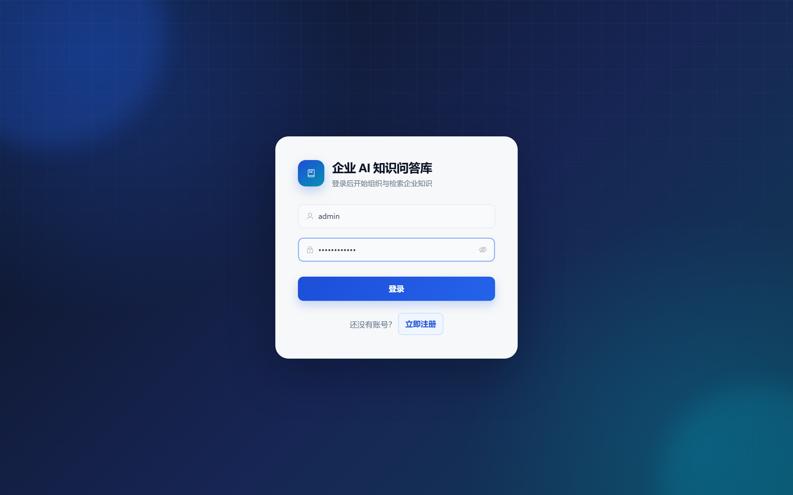
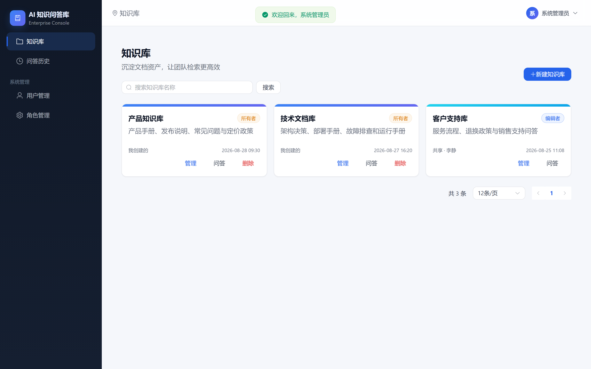
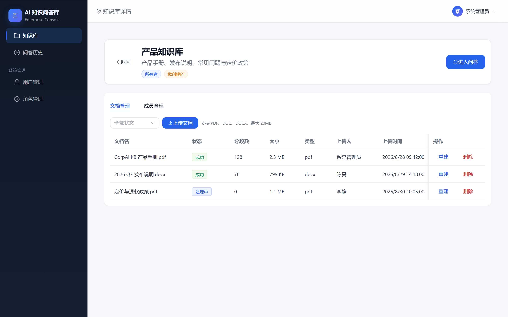
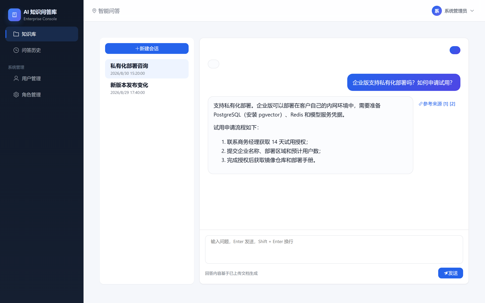
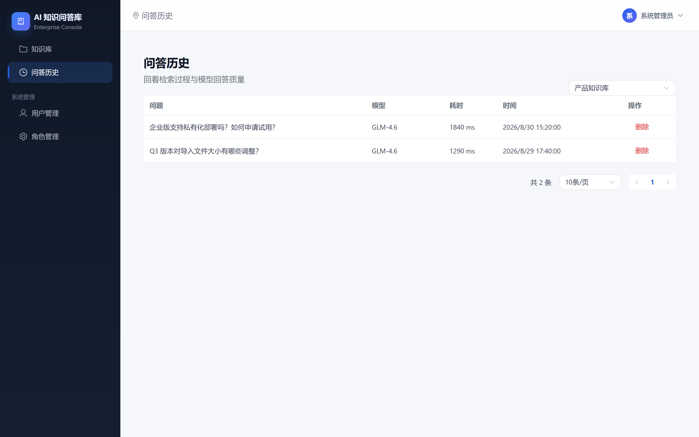
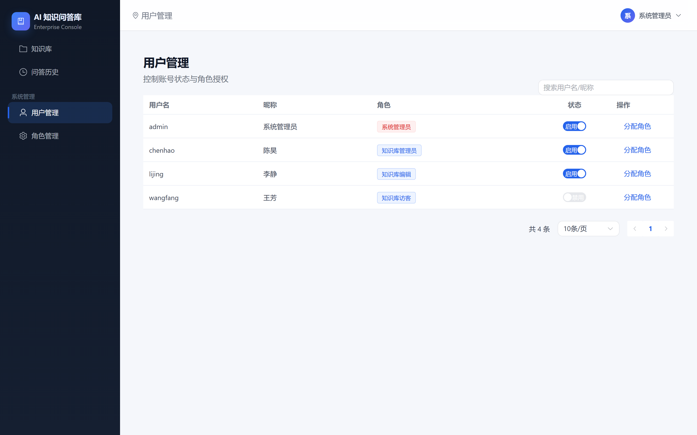
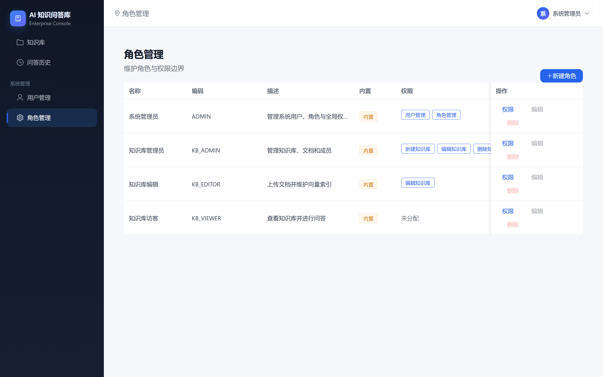
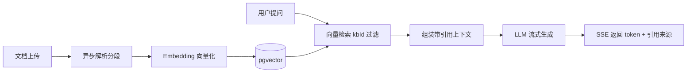

# CorpAI KB · 企业 AI 知识问答库

   

一个基于 **Spring Boot 3.5 + LangChain4j + PostgreSQL/pgvector** 与 **Vue 3 + Element Plus** 构建的企业级多知识库 RAG 问答平台。支持多知识库隔离、文档上传异步入库、SSE 流式问答带引用来源、会话记忆、问答历史与反馈，并内置 JWT 登录与 RBAC 权限体系。

## 功能特性

- **多知识库管理**：知识库 CRUD 与成员共享，库内角色分 OWNER / EDITOR / VIEWER 三级，检索与删除均限定库内范围
- **文档管理**：支持 PDF / DOC / DOCX 上传，落盘后异步解析、分段、向量化写入 pgvector，提供状态轮询、删除与重建索引
- **智能问答**：手动编排 RAG（向量检索 → 带引用编号的上下文组装 → LLM 流式生成），SSE 输出 `token` / `sources` / `done` 事件，回答附带引用来源与相似度
- **会话与历史**：会话绑定知识库，Redis 持久化聊天记忆；问答记录（含引用来源 JSONB）落库可查，支持点赞 / 点踩反馈
- **登录与权限**：Spring Security + JWT 无状态认证，用户-角色-权限三层 RBAC，菜单与按钮按权限码动态控制
- **系统管理**：用户管理、角色管理与权限分配

## 页面预览

| 登录 | 知识库列表 |
| --- | --- |
|  |  |

| 知识库详情 | 智能问答 |
| --- | --- |
|  |  |

| 问答历史 | 用户管理 | 角色管理 |
| --- | --- | --- |
|  |  |  |

## 技术栈

| 层次 | 技术 |
| --- | --- |
| 后端 | Java 21、Spring Boot 3.5、Spring Security + JJWT、MyBatis-Plus、LangChain4j 1.8 |
| 模型 | 智谱 GLM（对话）、DeepSeek（对话）、阿里云 DashScope 文本向量化（1536 维） |
| 存储 | PostgreSQL + pgvector（向量库）、Redis（聊天记忆） |
| 前端 | Vue 3、Vite、Element Plus、Pinia、Vue Router、Axios、marked + DOMPurify |



## 快速开始

### 环境要求

- JDK 21、Maven（或直接使用自带 Wrapper）
- Node.js ≥ 22.18（或 ≥ 24.12）
- PostgreSQL（需安装 [pgvector](https://github.com/pgvector/pgvector) 扩展）、Redis
- 模型 API Key：智谱（BigModel）、DeepSeek、阿里云 DashScope

### 初始化数据库

先创建数据库，再依次执行建表与内置数据脚本：

```sh
# 本地 PG 跑在 Docker 时的示例
docker exec -i <pg容器名> psql -U postgres -d <数据库名> -f /dev/stdin < langchain4j-java/sql/schema.sql
docker exec -i <pg容器名> psql -U postgres -d <数据库名> -f /dev/stdin < langchain4j-java/sql/init_data.sql
```

### 启动后端

```sh
cd langchain4j-java
# Windows 使用 mvnw.cmd，Linux/macOS 使用 ./mvnw
./mvnw spring-boot:run
```

后端默认监听 `8080` 端口，凭据均通过环境变量注入（见下表）。

### 启动前端

```sh
cd langchain4j-vue
npm install
npm run dev
```

访问 <http://localhost:5173>，Vite 已将 `/api` 代理到 `http://localhost:8080`。

### 初始账号

初始化脚本内置管理员账号：**admin / Admin@123456**（仅用于本地初始化，部署后请立即修改密码）。

## 环境变量

| 变量 | 说明 |
| --- | --- |
| `DB_PASSWORD` | PostgreSQL 密码 |
| `KB_JWT_SECRET` | JWT 签名密钥（≥ 32 字符，必须配置） |
| `ZHIPU_API_KEY` | 智谱 BigModel API Key |
| `DEEPSEEK_API_KEY` | DeepSeek API Key |
| `DASHSCOPE_API_KEY` | 阿里云 DashScope API Key（Embedding） |

> 生产环境务必通过环境变量或密钥管理服务注入凭据，不要硬编码在配置文件中。

## 目录结构

```text
corpai-kb
├── langchain4j-java        # 后端：Spring Boot 3.5 + LangChain4j
│   ├── src/main/java/com/xufg
│   │   ├── controller      # REST 接口
│   │   ├── service         # 业务逻辑（问答、入库、权限等）
│   │   ├── mapper          # MyBatis-Plus Mapper
│   │   ├── entity          # 数据库实体
│   │   ├── dto             # 请求/响应对象
│   │   ├── config          # Security/JWT/模型/线程池配置
│   │   └── common          # 通用返回、异常、上下文
│   ├── sql                 # 建表与初始化脚本
│   ├── docs                # 学习笔记
│   └── openspec            # 需求与设计规格
└── langchain4j-vue         # 前端：Vue 3 + Element Plus
    └── src
        ├── views           # 页面（登录/知识库/问答/历史/系统管理）
        ├── api             # 接口封装
        ├── stores          # Pinia 状态
        ├── router          # 路由与守卫
        ├── layout          # 主布局
        ├── utils           # Markdown 渲染等工具
        └── styles          # 全局样式与设计令牌
```

## API 概览

| 模块 | 主要接口 |
| --- | --- |
| 认证 | `POST /api/auth/login`、`POST /api/auth/register`、`GET /api/auth/me` |
| 知识库 | `GET/POST /api/kb`、`PUT/DELETE /api/kb/{id}`、成员管理 `/api/kb/{id}/members` |
| 文档 | `POST /api/kb/{kbId}/docs`（上传）、列表 / 详情、删除、重建索引 |
| 问答 | `POST /api/kb/{kbId}/chat/stream`（SSE）、会话创建与列表 |
| 历史 | `GET /api/history`、`GET /api/history/{id}` |
| 反馈 | `POST /api/feedback`（赞/踩，幂等） |
| 系统 | `/api/sys/users`、`/api/sys/roles`、`/api/sys/permissions` |

## 开源许可

本项目基于 [MIT License](LICENSE) 开源。

> 您可以自由使用、复制、修改和分发本项目，包括商业用途，唯一要求是保留原版权声明和许可文本。本项目按"现状"提供，作者不承担任何担保或责任。
